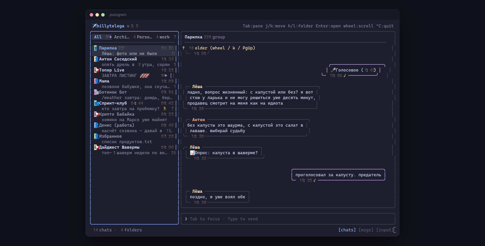
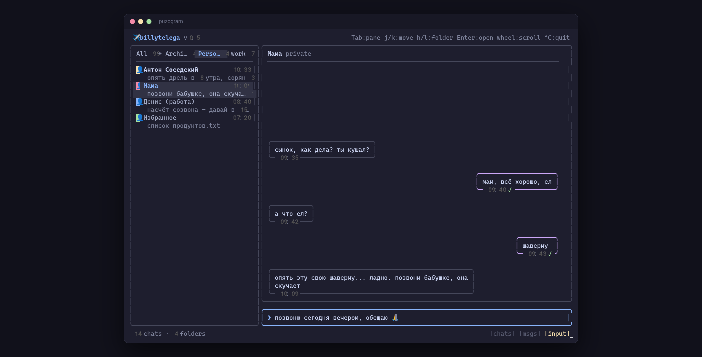
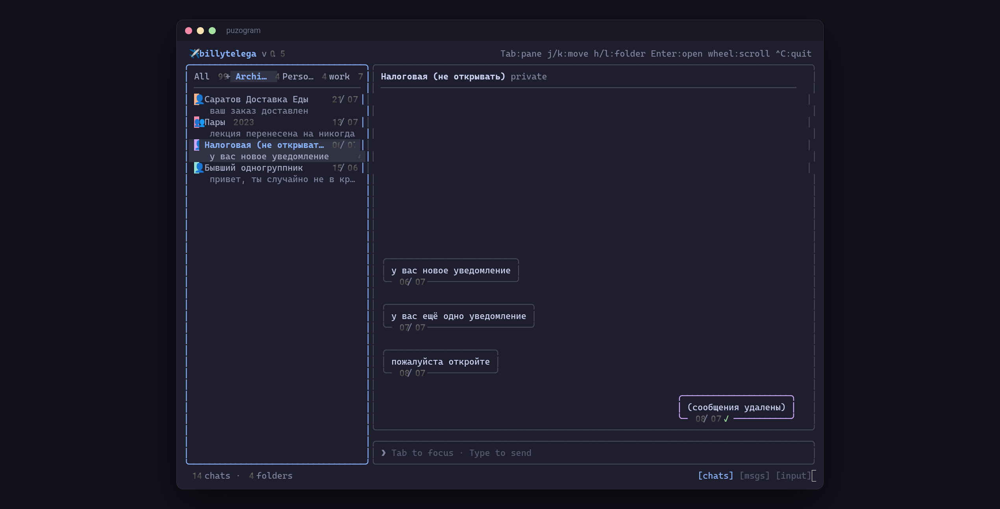

# puzogram

Terminal Telegram client — React Ink UI + GramJS MTProto. Catppuccin Mocha theme, chat folders, archive tab, mouse support.







## Run

```sh
export TG_API_ID=... TG_API_HASH=...  # https://my.telegram.org
npm install
npm run dev
```

Screenshots are rendered from 100% fake fixture data (`scripts/demo.tsx`).
